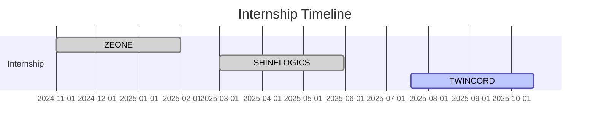

<h1 align="center">Hi 👋, I'm Vijayakanth M</h1>
<h3 align="center">AI/ML Engineer | Full Stack Developer | Problem Solver</h3>

  

---

### 🧠 About Me

- 🎓 B.Tech Artificial Intelligence and Machine Learning @ **Kongu Engineering College**
- 💻 Passionate about **AI, Web Development, and Intelligent Systems**
- 🏆 Hackathon Winner | Deep Learning Intern
- 📫 Reach me at: [vikymahendiran123@gmail.com](https://mail.google.com/mail/?view=cm&fs=1&to=vikymahendiran123@gmail.com)
- 🌐 Portfolio: [vkportfolio-8a5cb.web.app](https://vkportfolio-8a5cb.web.app)

---

### 📫 Connect With Me

---

### 💼 Skills & Tools

**Languages:**  
`Python` `C` `Java` `JavaScript` `HTML` `CSS`

**Frameworks/Stacks:**  
`React.js` `Node.js` `Express.js` `Spring Boot` `MERN`

**Databases:**  
`MongoDB` `MySQL`

**Others:**  
`Git` `GitHub` `Blender` `LLMs (Groq)` `NLP` `Flask`

---

### 📊 GitHub Stats

  
  
  

---

### 🧠 LeetCode Stats

  

---

### 🛠️ Notable Projects

| Project | Description |
|--------|-------------|
| **Fruit & Veg Identifier** | Real-time produce recognition system using Flask + Groq LLM |
| **AI Study Buddy** | Smart Telegram + Web App assistant with reminder & Q&A features |
| **Attendance Automation** | Replaced 1.5hrs manual tracking with 10-min MERN app |
| **DCGRAM** | Instagram clone with full auth, feeds, likes, and comments |
| **AI Stock Portfolio** | Visualizes investment returns + gives AI insights via CSV |
| **Refined CAPTCHA** | ML-based CAPTCHA alternative analyzing user behavior |

---

### 🧪 Internship Timeline

---

### 🏅 Achievements

- 🥇 **1st Place - Hacksphere 2025 Hackathon**
- 🥇 **1st - ENVISTAS 2025 & PRODOTHON 2025 Paper Presentation**
- 🥉 **3rd - AUTONIX 2024 Paper Presentation**
- 🏆 **Best Presentation - BYTS India Hackathon 1.0**

---

### 📜 Certifications

- 📌 MongoDB Associate Developer  
- 📌 Ethical Hacking - NPTEL  

---

### ⚡ Fun Facts

- 💬 Ask me about AI, Web Dev, or how to build your own chatbot with LLMs  
- 🎬 I love animation and video editing  
- 🔥 Always up for hackathons and open source collabs!

---

  

---

Made with ❤️ by <strong>Vijayakanth M</strong>

