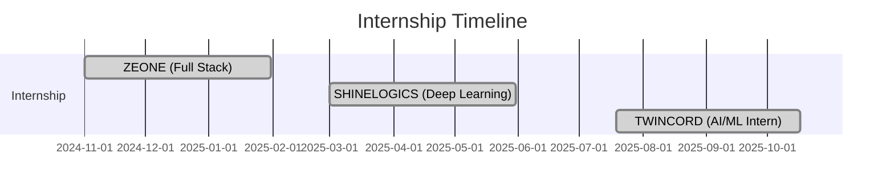

<h1 align="center">Hi 👋, I'm Vijayakanth M</h1>
<h3 align="center">🚀 AI/ML Engineer | 💻 Full Stack Developer | 🧠 Problem Solver</h3>

  

---

## 🧠 About Me

- 🎓 **AI & ML Engineering Student** at *Kongu Engineering College*, Erode  
- 🤖 Passionate about **Deep Learning, NLP, LLMs, and Generative AI**  
- 🏗️ Building **AI + MERN stack** projects with real-world impact  
- 🥇 Winner of multiple **hackathons and paper presentations**  
- 📩 Email: **vikymahendiran123@gmail.com**  
- 🌐 Portfolio: **https://vkportfolio-8a5cb.web.app**  

---

## 🌐 Connect With Me

  
  
  

---

## 💼 Skills & Tools

### 🔹 Programming  
`Python` · `Java` · `C` · `JavaScript`

### 🔹 Web Development  
`React.js` · `Node.js` · `Express.js` · `MERN Stack`  
`HTML` · `CSS`

### 🔹 Databases  
`MongoDB` · `MySQL`

### 🔹 AI & Machine Learning  
`Machine Learning` · `Deep Learning` · `CNN`  
`Computer Vision` · `NLP` · `LLMs (Groq, Ollama, Granite)`  
`Image Processing` · `Embeddings`

### 🔹 Tools  
`Git` · `GitHub` 

---

## 📊 GitHub Stats

  
  

  

---

## 🧠 LeetCode Stats

  

---

# 🚀 Major Projects (All From Resume)

| Project | Duration | Tech Stack | Description |
|--------|----------|-------------|-------------|
| **Refined CAPTCHA** | Jul 2025 – Oct 2025 | ML, React, Node | Behavioral CAPTCHA alternative using mouse + typing pattern analysis |
| **Classify Songs by Genre** | Aug 2024 – Dec 2024 | Python, ML, Audio Processing | Auto-classifies music using frequency features & ML (85% accuracy) |
| **Feedback Collection System** | Aug 2024 – Dec 2024 | Java, Spring Boot | Student course feedback portal with secure backend |
| **Dynamic Chatbot for Farm2Bag** | Feb 2025 – Feb 2025 | NLP, Python | Dynamic chatbot using website data scraping + product recommendations |
| **Attendance Automation System** | Feb 2025 – May 2025 | MERN | Reduced attendance marking from 1.5 hrs → 10 mins |
| **Fruit & Vegetable Identifier** | Mar 2025 – May 2025 | Flask, LLM, CV | Real-time produce classification using Groq + embeddings |
| **Visualizing Math – AI for Learning** | Apr 2025 – Apr 2025 | NLP, Flask, React | Personalized math tutor chatbot with adaptive difficulty |
| **DCGRAM – Instagram Clone** | Jan 2025 – Apr 2025 | MERN | Social media app with auth, posts, comments, followers |
| **AI Code Vulnerability Detector** | May 2025 – May 2025 | AI, Security, JS | AI-based code vulnerability scanning + editor + Telegram bot |
| **AI Stock Portfolio Manager** | May 2025 – Jun 2025 | Flask, ML, Matplotlib | CSV portfolio analysis + AI investment suggestions |
| **ProTube – Productive Video Platform** | Jul 2025 – Aug 2025 | React, API | Distraction-free educational video platform (blocks shorts & ads) |
| **ClauseWise – AI Legal Analyzer** | Sep 2025 – Sep 2025 | IBM Granite, Ollama | Legal clause simplifier + entity extraction + doc classification |
| **Fabric Defect Detection System** | Nov 2024 – Dec 2024 | CNN, CV | Real-time textile defect detection via webcam |
| **Material & Quantity Detection System** | Sep 2025 – Oct 2025 | ML Pipeline | Predicts construction materials & shipped quantity (85% accuracy) |

---

# 🧪 Internships

### 🏅 Achievements

| Achievement | Details |
|---|---|
| 🥇 1st Place | Hacksphere 2025 (24hr Hackathon) |
| 🥇 1st Place | PRODOTHON 2025 — PSG College |
| 🥇 1st Place | ENVISTAS 2025 — KEC College |
| 🥇 1st Place | SIH Internal Hackathon 2025 — KEC College |
| 🥈 2nd Place | Academic Excellence Award 2023 — Kongu Vellalar Trust |
| 🥈 2nd Place | Ideathon’25 (KEC College) |
| 🥉 3rd Place | AUTONIX 2024 — Paper Presentation |
| 🥉 3rd Place | CognitiveX GenAI 24hr Hackathon — IBM SkillBuild |
| 🏆 Top 4 Finalist | CTAI-CTD International Hackathon — IIT Bombay (Out of 80 teams) |
| 🏆 Best Presentation & Team | BYTS INDIA Hackathon (BIH) 1.0 — KEC College |

---

### 📜 Certifications

- 📌 MongoDB Associate Developer — MongoDB University  
- 📌 Ethical Hacking — NPTEL Certification  
- 📌 NVIDIA Diffusion Models – Nvidia Developer

---

### ⚡ Fun Facts

- 💬 Love building chatbots powered by LLMs  
- 🧠 I design & deploy AI/ML systems from scratch   
- 🔥 Hackathons fuel my creativity — always up for a challenge!  

---

  

